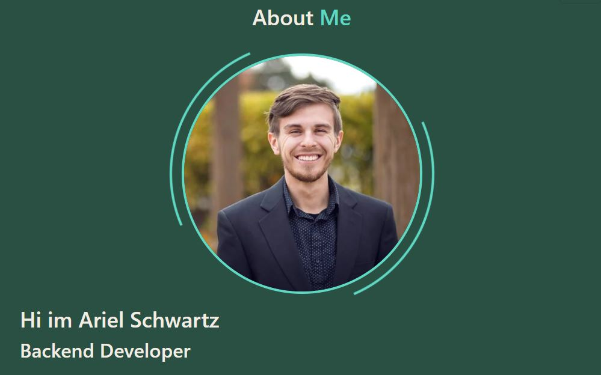

# My Portfolio 

## Description:

&nbsp; I'm Ariel Schwartz, a Full Stack Developer with a passion for building beautiful and functional web applications. I have B.S. in mechanical engineering from the University of Arizona (ABET) with a minor in mathematics. I have found demonstrating engineering rigor to be rewarding and aim to challenge myself with a new career and technical industry innovation. With a strong analytical background, 7+ years of industry experience using Mechanical Engineering, a certification in Full Stack including skills in Agile Software Development, I build client-based solutions. I’ve had the opportunity to work on a number of incredible projects that have allowed me to grow and establish myself within this competitive industry. I hope you’ll enjoy viewing some projects on my [portfolio](https://arishorts.github.io/arishorts-portfolio/) as much as I enjoyed working on them.

User Story: AS AN employer looking for candidates with experience building single-page applications
I WANT to view a potential employee's deployed React portfolio of work samples
SO THAT I can assess whether they're a good candidate for an open position

## Table of Contents:

- [Installation](#installation)
- [Usage](#usage)
- [Tests](#tests)
- [Badges](#badges)
- [How_to_Contribute](#how_to_contribute)
- [Questions](#questions)
- [License](#license)

## Installation:

&nbsp; None

## Usage:

&nbsp; The website can be found at: https://arishorts.github.io/arishorts-portfolio/

## Tests:

&nbsp; No

## Badges:

## How_to_Contribute:

&nbsp; If you would like to contribute, refer to the [Contributor Covenant](https://www.contributor-covenant.org/)

## Questions:

&nbsp; My GitHub profile can be found at: https://github.com/arishorts
 &nbsp; Reach me with additional questions at : arieljschwartz@gmail.com

## License:

&nbsp; http://choosealicense.com/licenses/mit/

---

© 2022 Ariel Schwartz LLC. Confidential and Proprietary. All Rights Reserved.
